# Multi-Author-Blog

"Multi autor blog" ,using mern stack (-node.js -express.js -react && react-redux -mongodb)

### 1- DASHBOARD ( admin can do the following)
- login
- crud categories, tags , articles
- in article text you can style text add images, vedio , upload and show external image
- see number of visitors, users , articles, categories and tags

### 2- USER ( can do the following)

- login, register
- login using Google
- read article
- like|| dislike article
- write and delete comment to article
- search article related to tags , categories

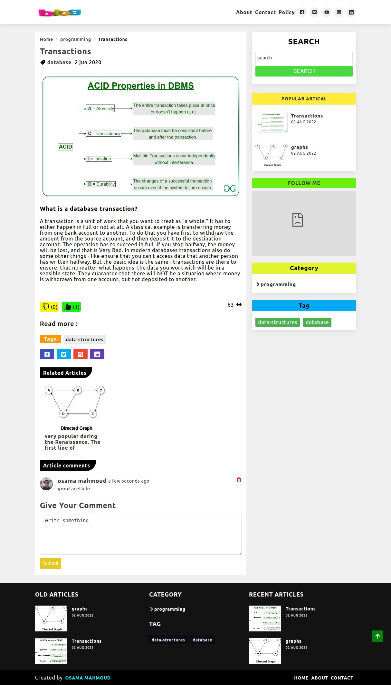

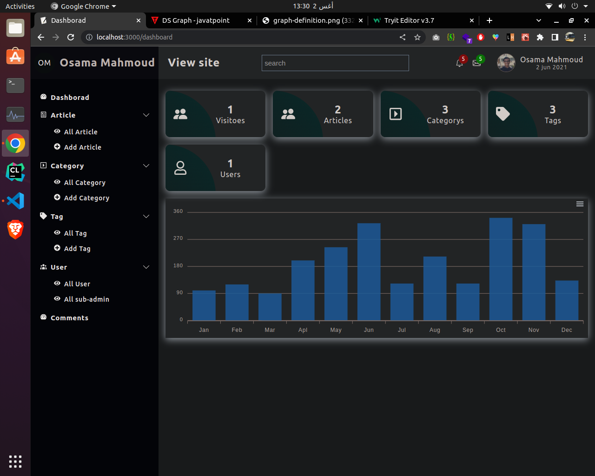
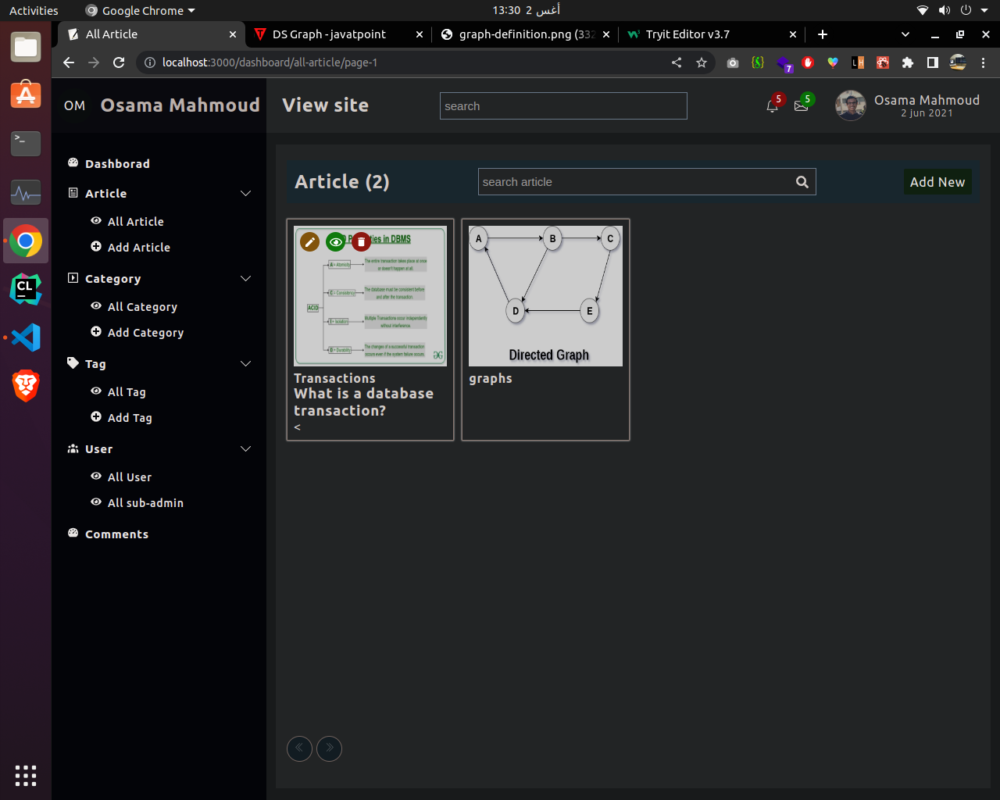
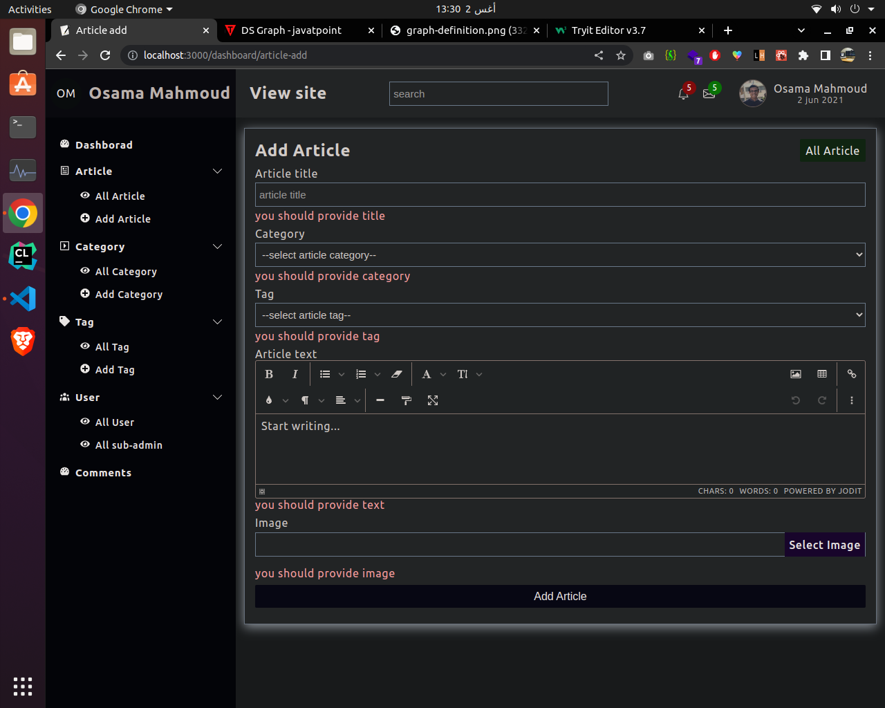
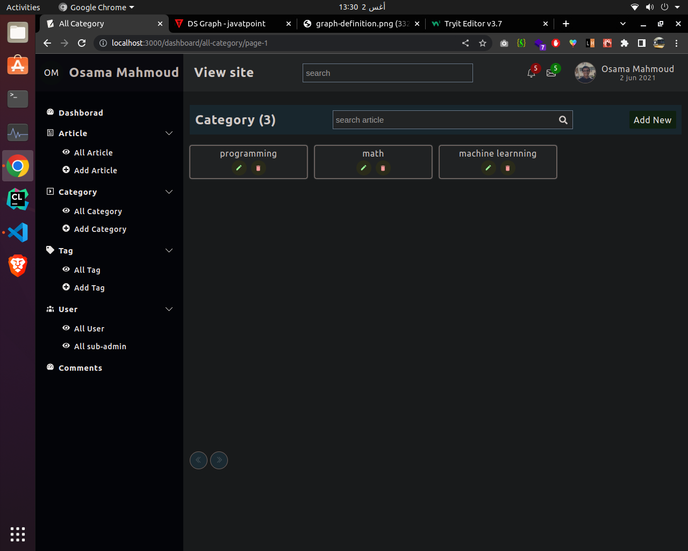
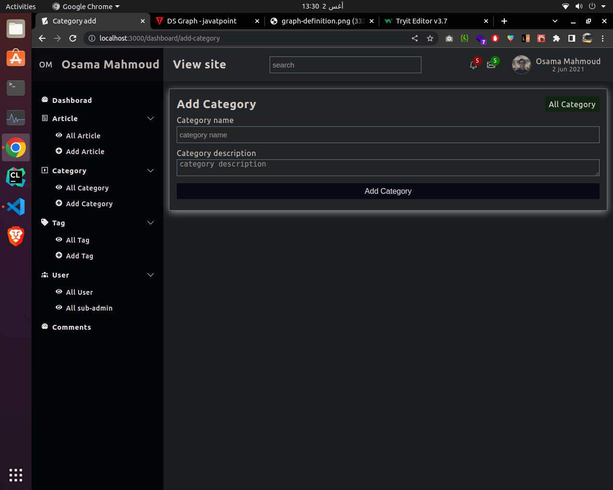
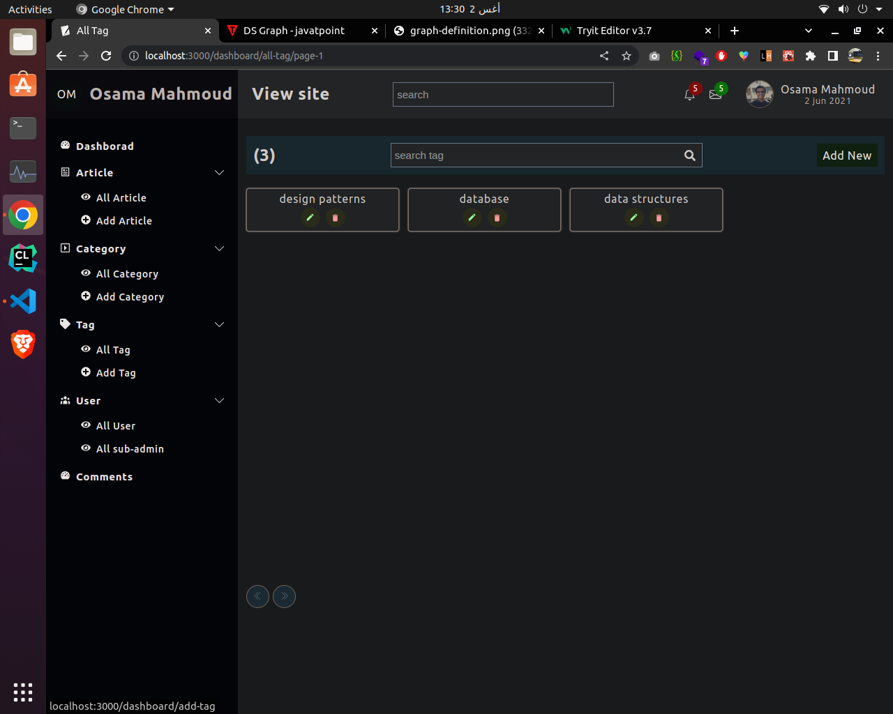
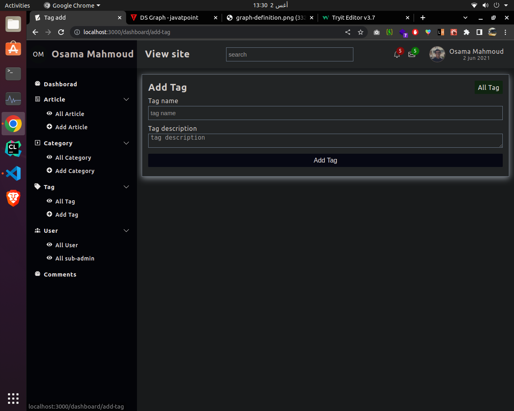
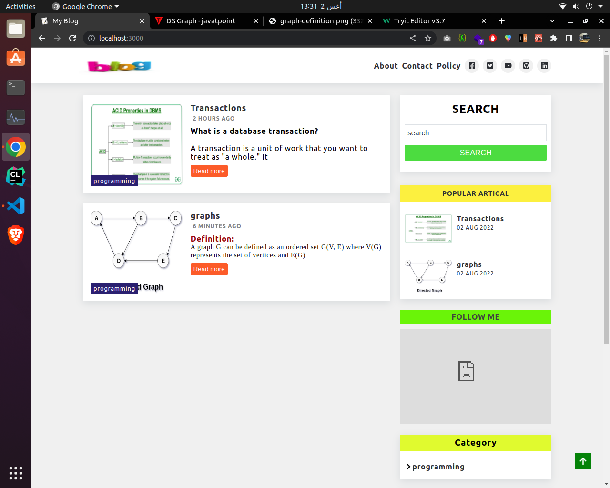
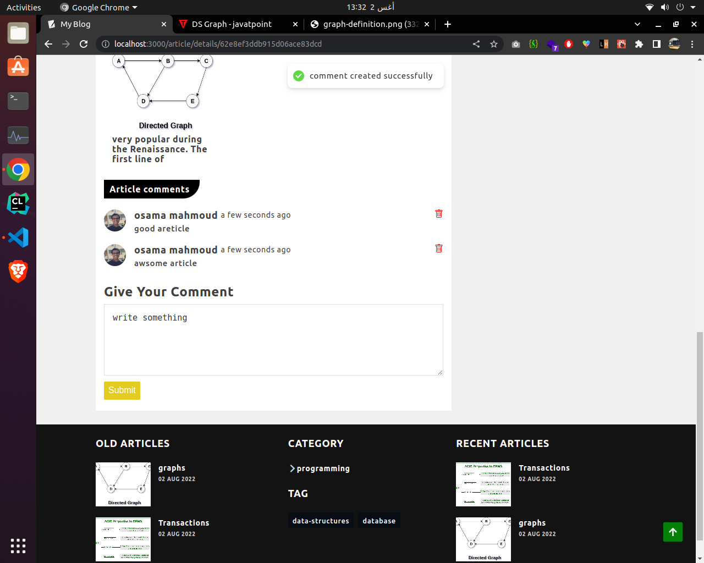
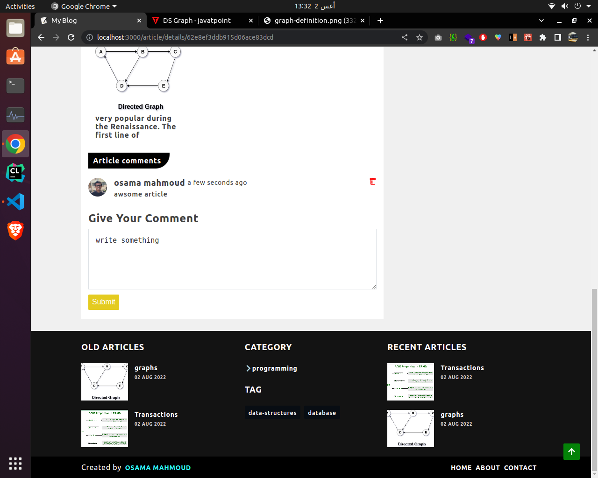
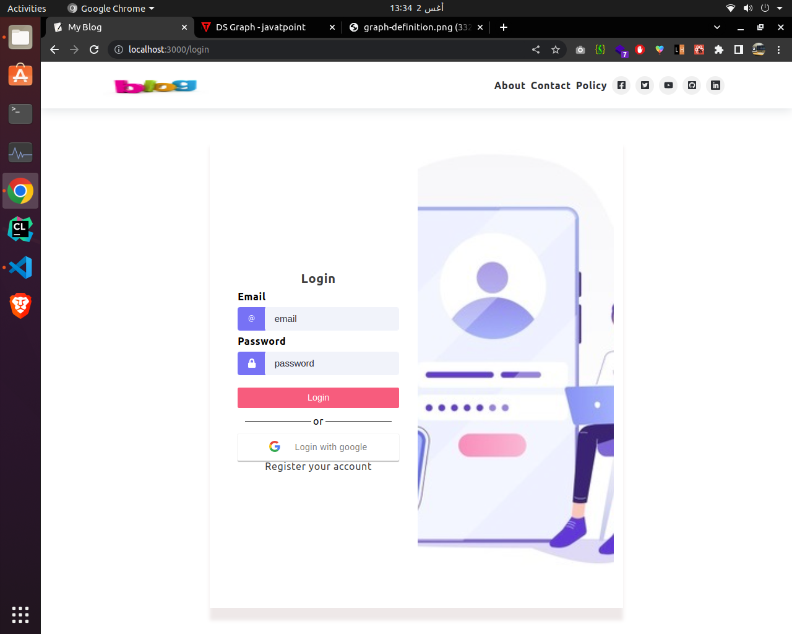
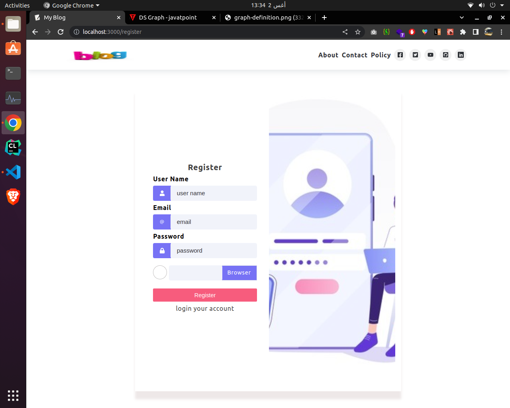

